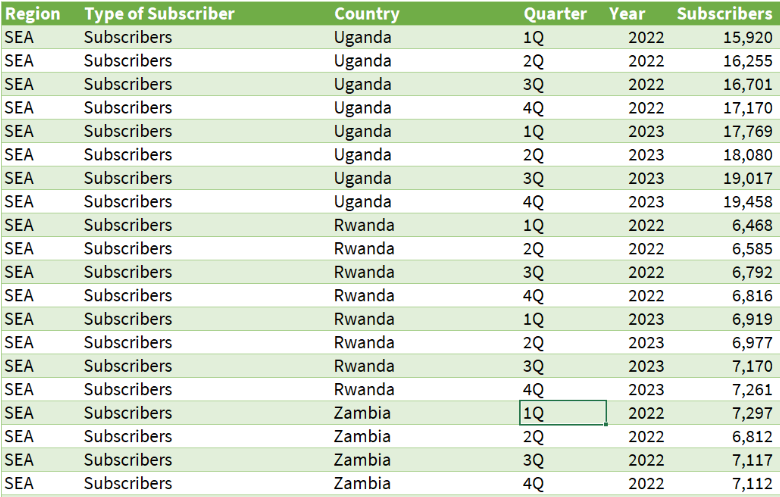

# Problem Statement and Brief
Using Power Query in Microsoft Excel, I transformed messy and unsturctured data into a sturctured format suitable for analysis. 
The key requirement for this project is create a robust solution that will automate this same cleaning process to new data with a 
similar structure without human intervention.

The final dataset looks like this:

## Methodology
First, split the data into three "sections" (representing each kind of subscription type) by duplicating the original query twice. Then, perform some transformations on each query:

- Replace values and remove nulls.
- Delete unwanted rows (totals) and columns.
- Unpivot the eight numerical columns and split them into "quarter" and "year."
- Next, append the queries back together and apply additional transformations.
- Ensure all data types are correct and consistent, and rename the columns.
- Join the data to another query (a dataset I created that maps each country to its region according to geography, as the original regions were incorrectly assigned) to pull in the respective regions and complete the dataset.
- Close and Load into a new sheet.

## Skills
Excel: Power Query, Data Cleaning, ETL, Automation, Data Analysis

# Next Steps
Build a PowerBI dashboard to visualise the information so the manager can extract meaningful insights.